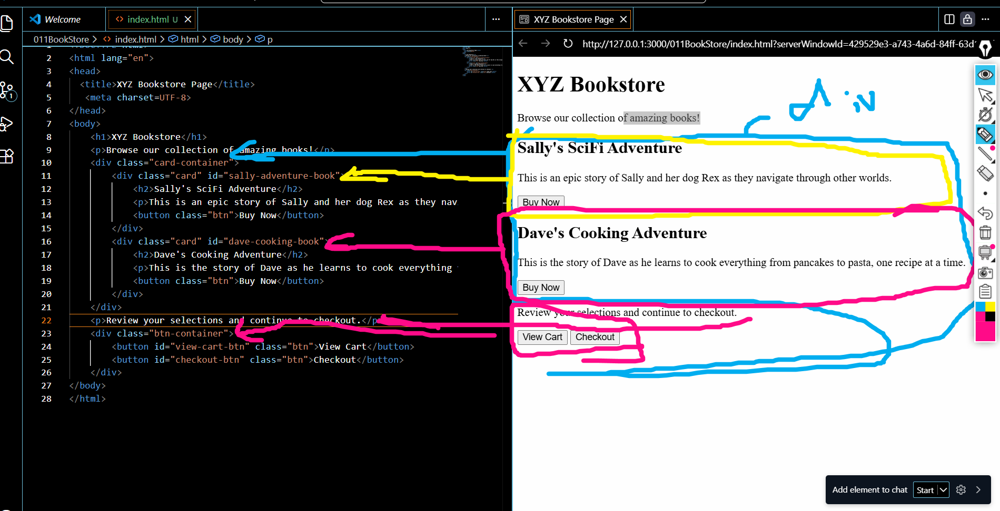

# 📚 Book Store Project

This is a simple **HTML Book Store webpage** created to practice the fundamentals of web development, especially working with **`div` elements**, **classes**, and **IDs**.

## 🚀 Project Overview

The page represents a small bookstore that displays books using card-style sections.  
It focuses on understanding:

- How **classes** can be shared between multiple elements to apply the same styling.
- How **IDs** are used to uniquely identify specific elements.
- Basic HTML page structure and layout.

## 🛠️ Technologies Used

- **HTML5**

## 🎯 What I Learned

- Structuring a webpage using semantic HTML
- Using `class` attributes for reusable styling
- Using `id` attributes for unique elements
- Organizing content into reusable card components

## 🌱 Inspiration

This project was inspired by **freeCodeCamp** and helped me practice building simple pages using pure HTML.

## 👤 Author
**Abdulbaset Saleh**

---

✨ *This project is part of my learning journey in web development.*
